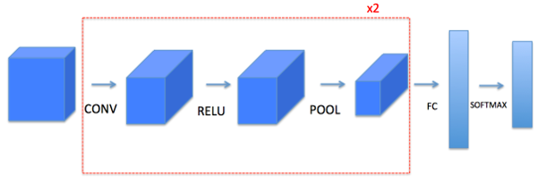
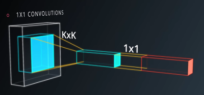
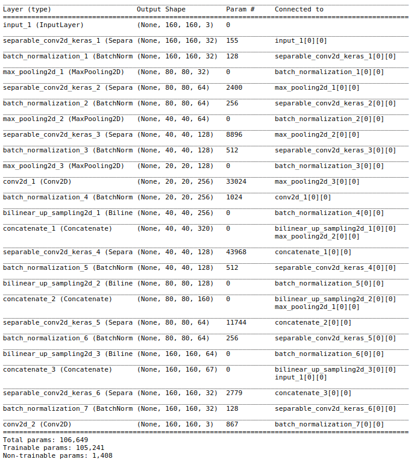
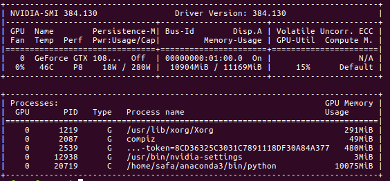
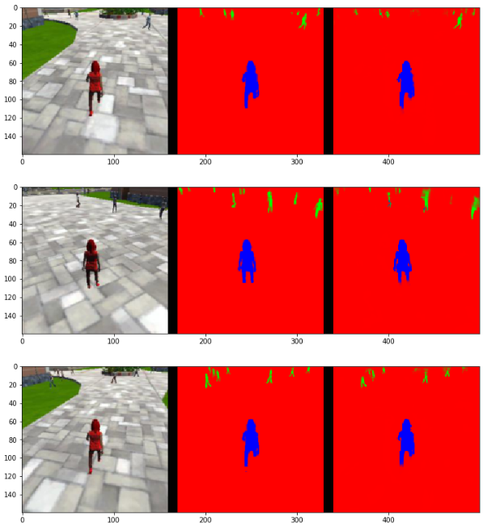
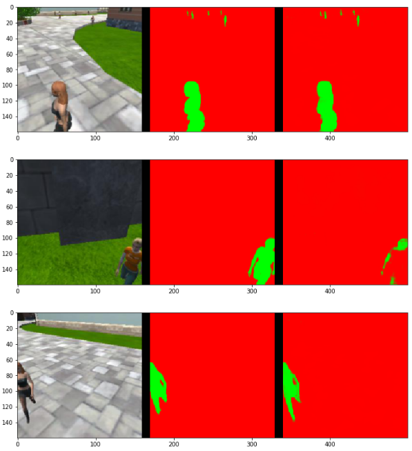
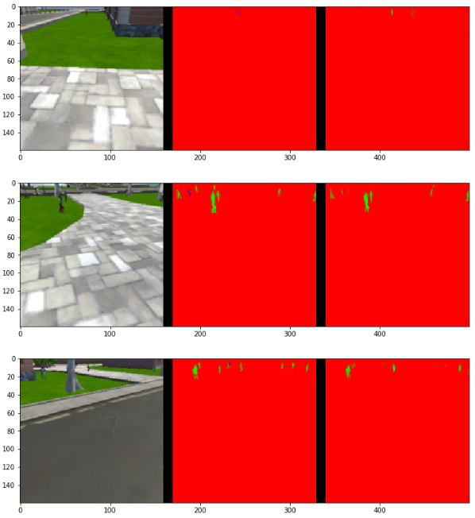
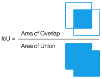

## Project : Follow Me! - Quadrotor Control by using a Cutting-Edge Visual Perception Method (Deep Learning FCN for Semantic Segmentation)

[followmegif]: docs/followme.gif
[conv2d]: docs/conv2d.png
[segm]: docs/segmentation1.jpg
[fcn-layers]: docs/fcn-layers.png
[modelsummary]: docs/model-summary.png
[tensorboard]: docs/cfn-tensor-graph.png
[nvidia]: docs/nvidia-smi.png
[t-curves]: docs/training-curves.png
[t-curves1]: docs/training-curves1.png
[t-curves2]: docs/training-curves2.png
[1x1conv]: docs/1x1convolution.png
[eval-target]: docs/eval-target.png
[petrol-without-target]: docs/petrol-without-target.png
[petrol-target]: docs/petrol-target.png
[iou]: docs/iou.png

In this project we will train a fully convolutional (FCN) deep neural network to identify and track a target in simulation. So-called “follow me” applications like this are key to many fields of robotics and the very same techniques you apply here could be extended to scenarios like advanced cruise control in autonomous vehicles or human-robot collaboration in industry. <br/>
The following gif shows a __testing model in the simulator__ which the quadrotor is perfectly able to identify and follow the target by using FCN semantic segmentation method.

<p align='center'>
    
</p>


### Fully Convolutional Network (FCN):

The conventional CNN approaches for classification consist a serial of convolutional layers and
then followed by fully connected layers to label each pixel with the class of its enclosing object or
region (follwing figure). Although programming frameworks make convolutions easy to use, they remain one of the hardest concepts to understand in Deep Learning. A convolution layer transforms an input volume into an output volume of different size and then follwed by activation function to help with the nonlinear computation in the network. The pooling layer is responsible to reduce the input dimensionality and may avoid overfitting in learning process.  

<p align='center'>
    
</p>

One of the main problems with using CNNs for segmentation is the fully connected layers have fixed dimensions and would throw away spatial coordinates. Another one is pooling layers. Pooling layers increase the field of view and are able to aggregate the context while discarding the where information. However, semantic segmentation requires the exact alignment of class maps and thus, needs the where information to be preserved, like the following figure. Hence, by converting the fully-connected layers into convolutional layers and concatenating the intermediate score maps, a fully convolutional network (FCN) is proposed to delineate the boundaries of each object.

<p align='center'>
    
</p>

### FCN Architecture and Implemented Techniques:
A Fully Convolutional neural network (FCN) is a normal CNN, where the last fully connected layer (classification layer) is substituted by another 1x1 convolution layer with a large "receptive field". The idea here is to capture the global context of the scene and enable us to tell what are the objects and their approximate locations in the scene. The output will be scene segmentation not only object classfication as it is the case in CNN.

The structure of FCN is divided into two parts (convolution or encoder) part which will extract features from the image and (transposed convolution, deconvolution or decoder) part which will upscale the output of the encoder (or reverse the convolution) so that it is in the original size of the image.

<p align='center'>
    
</p>

__1x1 convolution__ used instead of fully connected layers in order to preserve the spatial information and it can be use to reduce dimensionality. Fully connected layers are not used here because they usually common in classification task where spatial information are not so important. 1x1 convolutions has much less number of parameters than fully connected layers in case we want to learn reduced feature representation vector of our image. They are also useful for connecting already trained classifier like VGG of ResNet to the decoder layer and fine tune network for the segmentation task. Though, we don't use the fine tuning here and use the architecture to learn end-to-end segmentation task.

<p align='center'>
    
</p>

__Batch Normalization__ helps network automatically determines the scaling and shifting of the input data and prevents the decay gradient issue in depp layers backpropagation and help to obtain an optimized gradient descent. These parameters are learning together with all weights.

Network architecture used for the task employs __3 encoder layers__ with separable convolutions and batch normalization, 1x1 convolution to essentially learn segments with preserving spacial information and 3 decoder layer with bilinear upsampling and skip layers to relevant encoder layers. See figure below for details.

__Separable Convolutions__ decouple spatial and depth convolutions and greatly decreases the number of parameters in 5-8 times compared to standard convolutions. This helps to train network faster and what's more important to faster execute them on smaller embedded computing platforms usually used in robotics.

One problem with this approach is that we lose some information every time we do convolution (encoding or down-sampling); we keep the smaller picture (the local context) and lose the bigger picture (the global context). Max pooling does this by only retaining the maximum value for each filtered area, and removing the remaining values. To solve this problem we also get some activation from previous layers (What we call __skip connections__) and sum/interpolate them together with the up-sampled outputs when decoding from the previous layer as shown in below diagram.

FCN used for the segmatic segmentation in this project is consisting of the following layer blocks and components:
- __Encoder Blocks:__ three (3) encoder layers including separable 2D convolution layer (compressing down input), batch normalization layer and max pooling layer each 
- __1x1 Convolution Block:__ that capture the global context of the scene.
- __Decoder Blocks:__ three (3) decoder layers including batch normalization layer, bilinear up-sampling (decompressing input) and adding inputs from previous encoder blocks through total 3 skip connections to recover some of the lost information hence do the precise segmentation.
- __Softmax activation:__ used in the final layer of the FCN to take outputs from last decoder block and activate output pixels to indicate class and location of objects (semantic segmentation). here is text summaryfor model.summary():

<p align='center'>
    
</p>

To see more details regarding to the model graph in Tensorflow, here is the [link](https://github.com/nsafa/RoboND-DeepLearning-Project/blob/master/docs/cfn-tensor-graph.png) to its tensorboard graph.

### Software and Hardware for  Deep Learning in this Project:
I have used the following hardware and software:
- NVIDIA GEFORCE GTX 1080 Ti - 11G GPU dedicated memory / CPU i7-6850K CPU @ 3.60GHz × 12 
- Ubuntu 16.04 LTS
- NVIDIA Drivers 384.130
- NVIDIA CUDA 8.0
- NVIDIA cuDNN 5.1
see GPU details as follows:

<p align='center'>
    
</p>

I did not collect any more data from the simulator since I could reach all required steps using the existing training, validation and sample evaluation data sets. you can find these data sets as follows 
- /data/train ( including 4,131 images + 4,131 masks)
- /data/validation (including 1,184 images + 1,184 masks)
- /data/sample_evalution_data/following_images (including 542 images + 542 masks)
- /data/sample_evalution_data/patrol_non_targ (including 270 images + 270 masks)
- /data/sample_evalution_data/patrol_with_targ (including 322 images + 322 masks)


### FCN Implementation (Codes):

The following types of layers were used along with their python codes in FCN model:

__Separable Convolution Layer:__ Including batch normalization with ReLU activation function.

```python
def separable_conv2d_batchnorm(input_layer, filters, strides=1):
    output_layer = SeparableConv2DKeras(filters=filters,kernel_size=3, strides=strides,
                             padding='same', activation='relu')(input_layer)
    output_layer = layers.BatchNormalization()(output_layer) 
    return output_layer
```

__Regular Convolution Layer:__ Including 1x1 convolutional with batch normalization and ReLU activation function.

```python
def conv2d_batchnorm(input_layer, filters, kernel_size=3, strides=1):
    output_layer = layers.Conv2D(filters=filters, kernel_size=kernel_size, strides=strides, 
                      padding='same', activation='relu')(input_layer)
    output_layer = layers.BatchNormalization()(output_layer) 
    return output_layer
```
__Bilinear Upsampling Layer:__ Implemented in all decoder blocks.

```python
def bilinear_upsample(input_layer):
    output_layer = BilinearUpSampling2D((2,2))(input_layer)
    return output_layer
```
__Encoder Blocks:__ Total 3 encoder blocks used in the model. Each of them is included one separable convolution layer that is having batch normalization and ReLU activation function.

```python
def encoder_block(input_layer, filters, strides):   
    # Create a separable convolution layer using the separable_conv2d_batchnorm() function.
    output_layer = separable_conv2d_batchnorm(input_layer, filters, strides)  
    return output_layer
```
__Decoder Blocks:__ Total 3 decoder blocks which is consisting of Upsampler, a concatenate function for skip connection and then pass the resulting output to two layers of separable conv + batch normalization + ReLU activation function. 

```python
def decoder_block(small_ip_layer, large_ip_layer, filters):   
    # Upsample the small input layer using the bilinear_upsample() function.
    upsampled_small_ip_layer = bilinear_upsample(small_ip_layer)  
    # Concatenate the upsampled and large input layers using layers.concatenate
    output_layer = layers.concatenate([upsampled_small_ip_layer, large_ip_layer]) 
    # Add some number of separable convolution layers
    output_layer = separable_conv2d_batchnorm( output_layer, filters, strides=1)
    output_layer = separable_conv2d_batchnorm( output_layer, filters, strides=1)
    return output_layer
```
__Softmax Activation:__

```python
    outputs = layers.Conv2D(num_classes, 1, activation='softmax', padding='same')(dec3_layer)
```
__the FCN Model:__

```python
def fcn_model(inputs, num_classes):    
    # Add Encoder Blocks. 
    enc1_layer = encoder_block(    inputs,  32, strides=1)
    enc2_layer = encoder_block(enc1_layer,  64, strides=1)
    enc3_layer = encoder_block(enc2_layer, 128, strides=1)
    # Add 1x1 Convolution layer using conv2d_batchnorm().
    conv1x1_layer = conv2d_batchnorm(enc3_layer, 256, kernel_size=1, strides=1)
    # Add the same number of Decoder Blocks as the number of Encoder Blocks
    dec1_layer = decoder_block(conv1x1_layer, enc2_layer, 128)
    dec2_layer = decoder_block(   dec1_layer, enc1_layer,  64)
    dec3_layer = decoder_block(   dec2_layer,     inputs,  32)    
    # The function returns the output layer of your model. 
    return layers.Conv2D(num_classes, 3, activation='softmax', padding='same')(dec3_layer)
```

### Hyper Parameters:

I tried for this deep learning model with differnt hyper parameters i.e. __batch size (32, 64, 128, 256)__ and __learning rates between 0.0005 to 0.01__ with different epoch numbers. I chose the value of validation step based on a formula: validation sample number divided by batch size. I have already experienced with machine learning and particularly deep learning and provided a proper local system with a powerful gpu, so I did not need to work with AWS for this project and the parameter of cpu "worker". Steps per epoch can be a ceiling function of a value obtained from dividing the training samples number by batch size value. I used the Adam optimizer (as a default) and did not chenge it in my trials. 

To prevent the bias in training and better learning the model with a minimum training lost, I implemented __256 filters for 1x1 convolution layer__ instead of the default number of 64 filters that it led to an increase in the total weight parameters by almost double for the model(105,241 parameters). Therefore, I could learn my FCN model with three different hyper parameter sets depends on trail and error method which are able to satisfy the required IOU test score (>0.4). These three hyper parameter sets are the following:  


<table><tbody>
    <tr><th align="center" colspan="4">Hyper Parameters Set 1</td></tr>
    <tr><td align="left">learning_rate: 0.001 </td><td align="left">batch_size: 128</td>
    <td align="left">num_epochs: 70</td><td align="left">steps_per_epoch: 33</td></tr>    
    <tr><td align="left">validation_steps: 12 </td><td align="left">train_loss: 0.0174</td>
    <td align="left">val_loss: 0.0286</td><td align="left">final_score: 0.4058</td></tr> 
</tbody></table>

![trainingcurve][t-curves]

<table><tbody>
    <tr><th align="center" colspan="4">Hyper Parameters Set 2</td></tr>
    <tr><td align="left">learning_rate: 0.01 </td><td align="left">batch_size: 32</td>
    <td align="left">num_epochs: 100</td><td align="left">steps_per_epoch: 130</td></tr>    
    <tr><td align="left">validation_steps: 37 </td><td align="left">train_loss: 0.0136</td>
    <td align="left">val_loss: 0.0290</td><td align="left">final_score: 0.4326</td></tr> 
</tbody></table>

![trainingcurve1][t-curves1]

<table><tbody>
    <tr><th align="center" colspan="4">Hyper Parameters Set 3</td></tr>
    <tr><td align="left">learning_rate: 0.007 </td><td align="left">batch_size: 32</td>
    <td align="left">num_epochs: 100</td><td align="left">steps_per_epoch: 130</td></tr>    
    <tr><td align="left">validation_steps: 37 </td><td align="left">train_loss: 0.0135</td>
    <td align="left">val_loss: 0.0277</td><td align="left">final_score: 0.4602</td></tr> 
</tbody></table>
   
![trainingcurve2][t-curves2]

You can find the HTML version of model_training.ipynb notebook for these three cases in the code folder on this [link](https://github.com/nsafa/RoboND-DeepLearning-Project/tree/master/code). 

### Prediction and Evaluation:

Three different sample evaluation data sets are available from the helper code (as mentioned earlier) which are used to evaluate how well the FCN model is doing under different conditions 

Below is taken from one of the test trainings runs (Parameters Set 3).

__Images while following the target:__ we evaluated how often the model makes a right decision and identifies the right person as the target on the 


<p align='center'>
    
</p>

__Scores for while the quad is following behind the target.__ <br/>
number of validation samples intersection over the union evaulated on 542 <br/> 
average intersection over union for background is 0.9959687504068635 <br/> 
average intersection over union for other people is 0.38065053965159495 <br/> 
average intersection over union for the hero is 0.905131391830303 <br/> 
number true positives: 539, number false positives: 0, number false negatives: 0 <br/> 

__Images while at patrol without target:__ we evaluated how often the model makes a mistake and identifies the wrong person as the target.
 
<p align='center'>
    
</p>

__Scores for images while the quad is on patrol and the target is not visable:__ <br/>
number of validation samples intersection over the union evaulated on 270 <br/>
average intersection over union for background is 0.9877856713508242 <br/>
average intersection over union for other people is 0.735363402509011 <br/>
average intersection over union for the hero is 0.0 <br/>
number true positives: 0, number false positives: 83, number false negatives: 0 <br/>

__Images while at patrol with target:__ We evaluate how well the model can detect the target from a distance.

<p align='center'>
    
</p>

__This score measures how well the neural network can detect the target from far away:__ <br/>
number of validation samples intersection over the union evaulated on 322 <br/> 
average intersection over union for background is 0.9964651913339608 <br/>
average intersection over union for other people is 0.46814013260453274 <br/>
average intersection over union for the hero is 0.301131015531467 <br/>
number true positives: 166, number false positives: 1, number false negatives: 135 <br/>

__IoU (Intersection over Union)__ is one of the best __evaluation method__ for object detection. Here, we used the IoU to calculate the final score. The intersection set represents an AND operation (pixels that are truly part of a class AND are classified as part of the class by the network) and the Union represents an OR operation (pixels that are truly part of that class + pixels that are classified as part of that class by the network).

<p align='center'>
    
</p>

According to the model results and evaluation scores of IoU1, IoU2 and IoU3, the low value is belong to IoU3 while IoU1 has achieved score of more than 0.90 in three successful trials. IoU3 measures how well the neural network can detect the target from far away and a quite strict metric, the target from far away would be vague pixels in particular with a quite low resolution image in this project. Only IoU3 score of 0.3 is achieved finally.

### Testing Model in the Simulator:
The best model (with hyper parameters set 3) was selected and copied the saved model weights to the code folder, started the simulator, then ran the following command to test the model in simulator:

python3 follower.py --pred_viz model_weights

In the first of this report (Readme) you can see the recording of the test as a gif format, or through this [link](https://github.com/nsafa/RoboND-DeepLearning-Project/blob/master/docs/followme.gif). 

__Using the same model to track other objects:__
There is no need to change in the model structure and network architecture when you want to change in target or size of input data. all what we need is to change the mask data and train again on the new target then use the same network to track the new object. However, if you decided to cope with some issues like object distance from camera or some performance improvements, the architecture change such as adding more layers or regularization terms in layers would be one of the solutions.  

### Improvements
- Bigger training dataset are preferred.
- Impelement the transfer learning method and then fine tuning by using pre-trained networks such as Resnet and VGG models. 
- Conditional Random Field (CRF) is commonly used to refine boundary based on the underlying image intensities in FCN architecture, it would be helpful if CRF is added for this project.
- To reduce bias and overfitting, we can add more layers and kernel filters to the network, and implement the regularization techniques in some layers respectively.  


## Setup Instructions

**Download the QuadSim binary**

To interface your neural net with the QuadSim simulator, you must use a version QuadSim that has been custom tailored for this project. 

**Install Dependencies**

You'll need Python 3 and Jupyter Notebooks installed to do this project. 

If for some reason you choose not to use Anaconda, you must install the following frameworks and packages on your system:
* Python 3.x
* Tensorflow 1.2.1
* NumPy 1.11
* SciPy 0.17.0
* eventlet 
* Flask
* h5py
* PIL
* python-socketio
* scikit-image
* transforms3d
* PyQt4/Pyqt5

## Implement the Segmentation Network
1. Download the training dataset from above and extract to the project `data` directory.
2. Implement your solution in model_training.ipynb
3. Train the network locally, or on AWS.
4. Continue to experiment with the training data and network until you attain the score you desire.
5. Once you are comfortable with performance on the training dataset, see how it performs in live simulation!

## Collecting Training Data ##
A simple training dataset has been provided in this project's repository. This dataset will allow you to verify that your segmentation network is semi-functional. However, if your interested in improving your score,you may want to collect additional training data. To do it, please see the following steps.

The data directory is organized as follows:
```
data/runs - contains the results of prediction runs
data/train/images - contains images for the training set
data/train/masks - contains masked (labeled) images for the training set
data/validation/images - contains images for the validation set
data/validation/masks - contains masked (labeled) images for the validation set
data/weights - contains trained TensorFlow models

data/raw_sim_data/train/run1
data/raw_sim_data/validation/run1
```

### Training Set ###
1. Run QuadSim
2. Click the `DL Training` button
3. Set patrol points, path points, and spawn points. **TODO** add link to data collection doc
3. With the simulator running, press "r" to begin recording.
4. In the file selection menu navigate to the `data/raw_sim_data/train/run1` directory
5. **optional** to speed up data collection, press "9" (1-9 will slow down collection speed)
6. When you have finished collecting data, hit "r" to stop recording.
7. To reset the simulator, hit "`<esc>`"
8. To collect multiple runs create directories `data/raw_sim_data/train/run2`, `data/raw_sim_data/train/run3` and repeat the above steps.


### Validation Set ###
To collect the validation set, repeat both sets of steps above, except using the directory `data/raw_sim_data/validation` instead rather than `data/raw_sim_data/train`.

### Image Preprocessing ###
Before the network is trained, the images first need to be undergo a preprocessing step. The preprocessing step transforms the depth masks from the sim, into binary masks suitable for training a neural network. It also converts the images from .png to .jpeg to create a reduced sized dataset, suitable for uploading to AWS. 
To run preprocessing:
```
$ python preprocess_ims.py
```
**Note**: If your data is stored as suggested in the steps above, this script should run without error.

**Important Note 1:** 

Running `preprocess_ims.py` does *not* delete files in the processed_data folder. This means if you leave images in processed data and collect a new dataset, some of the data in processed_data will be overwritten some will be left as is. It is recommended to **delete** the train and validation folders inside processed_data(or the entire folder) before running `preprocess_ims.py` with a new set of collected data.

**Important Note 2:**

The notebook, and supporting code assume your data for training/validation is in data/train, and data/validation. After you run `preprocess_ims.py` you will have new `train`, and possibly `validation` folders in the `processed_ims`.
Rename or move `data/train`, and `data/validation`, then move `data/processed_ims/train`, into `data/`, and  `data/processed_ims/validation`also into `data/`

**Important Note 3:**

Merging multiple `train` or `validation` may be difficult, it is recommended that data choices be determined by what you include in `raw_sim_data/train/run1` with possibly many different runs in the directory. You can create a temporary folder in `data/` and store raw run data you don't currently want to use, but that may be useful for later. Choose which `run_x` folders to include in `raw_sim_data/train`, and `raw_sim_data/validation`, then run  `preprocess_ims.py` from within the 'code/' directory to generate your new training and validation sets. 


## Training, Predicting and Scoring ##
With your training and validation data having been generated or downloaded from the above section of this repository, you are free to begin working with the neural net.

**Note**: Training CNNs is a very compute-intensive process. If your system does not have a recent Nvidia graphics card, with [cuDNN](https://developer.nvidia.com/cudnn) and [CUDA](https://developer.nvidia.com/cuda) installed , you may need to perform the training step in the cloud. 

### Training your Model ###
**Prerequisites**
- Training data is in `data` directory
- Validation data is in the `data` directory
- The folders `data/train/images/`, `data/train/masks/`, `data/validation/images/`, and `data/validation/masks/` should exist and contain the appropriate data

To train complete the network definition in the `model_training.ipynb` notebook and then run the training cell with appropriate hyperparameters selected.

After the training run has completed, your model will be stored in the `data/weights` directory as an [HDF5](https://en.wikipedia.org/wiki/Hierarchical_Data_Format) file, and a configuration_weights file. As long as they are both in the same location, things should work. 

**Important Note** the *validation* directory is used to store data that will be used during training to produce the plots of the loss, and help determine when the network is overfitting your data. 

The **sample_evalution_data** directory contains data specifically designed to test the networks performance on the FollowME task. In sample_evaluation data are three directories each generated using a different sampling method. The structure of these directories is exactly the same as `validation`, and `train` datasets provided to you. For instance `patrol_with_targ` contains an `images` and `masks` subdirectory. If you would like to the evaluation code on your `validation` data a copy of the it should be moved into `sample_evaluation_data`, and then the appropriate arguments changed to the function calls in the `model_training.ipynb` notebook.

The notebook has examples of how to evaulate your model once you finish training. Think about the sourcing methods, and how the information provided in the evaluation sections relates to the final score. Then try things out that seem like they may work. 

## Scoring ##

To score the network on the Follow Me task, two types of error are measured. First the intersection over the union for the pixelwise classifications is computed for the target channel. 

In addition to this we determine whether the network detected the target person or not. If more then 3 pixels have probability greater then 0.5 of being the target person then this counts as the network guessing the target is in the image. 

We determine whether the target is actually in the image by whether there are more then 3 pixels containing the target in the label mask. 

Using the above the number of detection true_positives, false positives, false negatives are counted. 

**How the Final score is Calculated**

The final score is the pixelwise `average_IoU*(n_true_positive/(n_true_positive+n_false_positive+n_false_negative))` on data similar to that provided in sample_evaulation_data

**Ideas for Improving your Score**

Collect more data from the sim. Look at the predictions think about what the network is getting wrong, then collect data to counteract this. Or improve your network architecture and hyperparameters. 

**Obtaining a Leaderboard Score**

Share your scores in slack, and keep a tally in a pinned message. Scores should be computed on the sample_evaluation_data. This is for fun, your grade will be determined on unreleased data. If you use the sample_evaluation_data to train the network, it will result in inflated scores, and you will not be able to determine how your network will actually perform when evaluated to determine your grade.

## Experimentation: Testing in Simulation
1. Copy your saved model to the weights directory `data/weights`.
2. Launch the simulator, select "Spawn People", and then click the "Follow Me" button.
3. Run the realtime follower script
```
$ python follower.py my_amazing_model.h5
```

**Note:** If you'd like to see an overlay of the detected region on each camera frame from the drone, simply pass the `--pred_viz` parameter to `follower.py`
